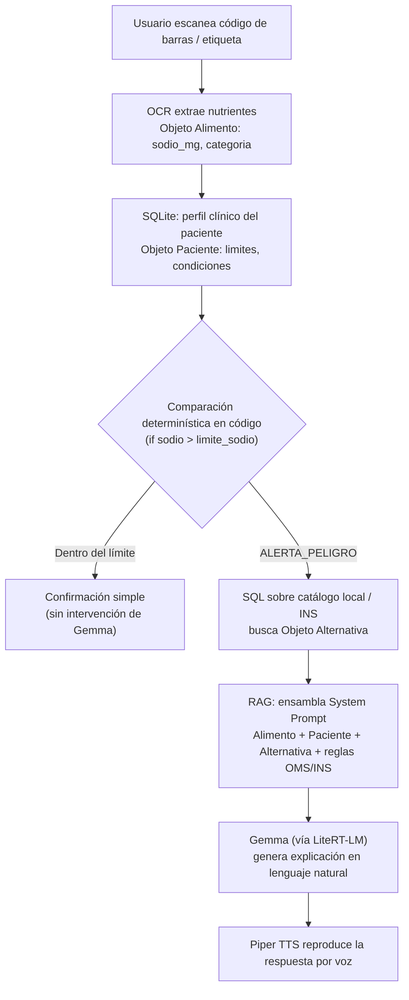
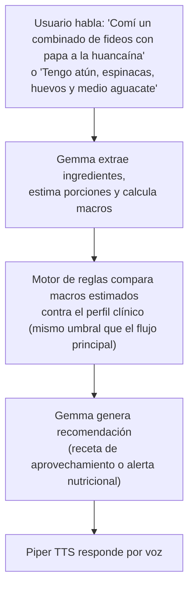

# GemSpark — MVP Técnico
### Nutrición de precisión para pacientes crónicos, impulsada por Gemma

**Proyecto para:** Build with Gemma – GDG Lima (Kaggle)

---

## 0. Nota sobre la fuente de la competencia

La página de Kaggle `build-with-gemma-gdg-lima-ai` se renderiza con JavaScript del lado del cliente, por lo que no fue posible extraer su texto completo (overview/rules) de forma automática. Para no inventar datos, el contexto de competencia de este documento se basa en el patrón que comparten **todas** las ediciones locales de la serie "Build with Gemma" (Nagpur, Rajkot, Windsor, Pwani, entre otras), todas ancladas al hackathon global **"The Gemma 4 Good Hackathon"** de Kaggle. Antes de la entrega final, el equipo debería confirmar en la página oficial de GDG Lima: fecha límite exacta, track/categoría asignada y estructura de premios, ya que esos tres puntos sí varían por sede.

Elementos consistentes en toda la serie:

- **Objetivo:** construir una aplicación de impacto real usando modelos abiertos **Gemma**, no un simple wrapper de API — el jurado busca uso *significativo* del modelo (local/on-device, multimodal, function calling, fine-tuning/RAG, o despliegue en el edge).
- **Criterios de evaluación:** Impacto y visión · Storytelling y pitch en video · Profundidad técnica y ejecución.
- **Entregables típicos:** cuenta de Kaggle verificada, write-up público, repositorio de código público, demo pública, video público.
- **Tracks recurrentes en la serie:** Salud y Ciencias, Resiliencia Global, Futuro de la Educación, Equidad Digital e Inclusión, Seguridad y Confianza.

**GemSpark encaja principalmente en Salud y Ciencias**, con un componente fuerte de **Equidad Digital e Inclusión** (voz en vez de pantallas, catálogo local en vez de productos importados) y de **Resiliencia/seguridad alimentaria** (aprovechamiento de despensa en contextos de crisis económica).

> ⚠️ **Punto a verificar por el equipo:** las Tareas.txt especifican `gemma2:2b` / `gemma2:9b` cuantizado como modelo base. Si la edición GDG Lima exige explícitamente la familia **Gemma 4** (como ya ocurre en varias sedes 2026), conviene evaluar las variantes ligeras de Gemma 4 para no quedar fuera de las bases del concurso — el resto de la arquitectura (RAG, umbrales, TTS) no cambia.

---

## 1. El problema

GemSpark responde a tres problemáticas concretas y verificables en el Perú:

**A) Cero fricción para el paciente crónico.** El 70% de la alimentación en el Perú es comida casera o de menú, no productos empaquetados. Adultos mayores o personas con baja alfabetización digital abandonan las apps de nutrición porque no quieren (o no saben) pesar y tipear "150 gramos de pechuga".

**B) Inseguridad alimentaria y crisis económica del hogar.** La inflación alimentaria golpea directo la canasta básica. Familias y ollas comunes comen lo que tienen disponible ese día, lo que muchas veces deriva en anemia infantil o descompensaciones de glucosa/presión por mala combinación de carbohidratos baratos.

**C) Centralismo y falta de acceso a productos "dietéticos".** Recomendar leche de almendras o sal rosada a alguien en Huancayo, Puno o San Juan de Lurigancho es una recomendación inútil y elitista: ese producto no está disponible ni es asequible ahí.

En los tres casos, el paciente crónico (hipertenso, diabético, o ambos) necesita una guía **inmediata, hablada, y basada en lo que ya tiene**, no un formulario más.

---

## 2. Nuestra solución

**GemSpark** es un asistente de nutrición que combina **reglas clínicas determinísticas** (no negociables, no alucinables) con **Gemma** para la parte conversacional. La idea central: *la seguridad del paciente nunca depende del LLM — el LLM solo explica y humaniza una decisión que ya tomó el código.*

Flujo del usuario (caso principal — escaneo de producto empaquetado):

1. El paciente escanea el código de barras / etiqueta de un producto con la cámara.
2. OCR extrae los nutrientes (sodio, azúcar, etc.).
3. La app compara ese valor contra el umbral clínico del paciente (definido por su condición: hipertensión, diabetes, ambas, o ninguna).
4. Si el producto es peligroso, se busca automáticamente una alternativa más segura en el catálogo local/INS.
5. Gemma recibe todo el contexto ya resuelto (alimento, paciente, alternativa, reglas OMS/INS) y genera una explicación breve, humana y accionable.
6. Esa explicación se reproduce por voz — **Don Juan no necesita leer nada.**

Funcionalidades adicionales (registro por voz de comidas caseras, recetas de aprovechamiento de despensa, recomendación hiperlocal) siguen la misma lógica: información estructurada primero, Gemma explica después.

### Tabla de umbrales clínicos (configuración base en SQLite)

| Lo que responde el usuario | Lo que configura SQLite internamente |
|---|---|
| "Tengo hipertensión" | `limite_sodio_producto = 400 mg` |
| "Tengo diabetes" | `limite_azucar_producto = 5 g` |
| "Tengo ambas condiciones" | `limite_sodio = 350 mg` \| `limite_azucar = 5 g` |
| "No tengo enfermedades, quiero cuidarme" | Umbrales estándar de la **Ley de Octógonos del MINSA** |

---

## 3. Arquitectura

### 3.1 Vista general de capas

| Capa | Tecnología | Rol |
|---|---|---|
| Frontend | React + TypeScript | Captura de cámara/voz, UI del paciente, muestra recomendación |
| Backend / API | FastAPI (Python) | Orquesta OCR → SQLite → motor de reglas → RAG → Gemma |
| Motor de reglas determinístico | Código (if/else), no IA | Compara alimento vs. umbral clínico del paciente |
| Base de datos | SQLite | Perfil clínico del paciente + catálogo de productos/INS |
| Orquestación IA / RAG | LangChain (Python) | Ensambla el prompt con conocimiento nutricional |
| Modelo de lenguaje | Gemma 2:2B (máxima precisión) o Gemma 2:9B cuantizado Q4_K_M | Genera la explicación/recomendación final en lenguaje natural |
| Motor de inferencia local | LiteRT-LM | Corre Gemma on-device / en el servidor local |
| Salida de voz | Piper TTS | Convierte la respuesta de Gemma en audio |
| Despliegue MVP | Laptop como servidor local (demo) | Visión futura: edge en Android |

### 3.2 Diagrama de flujo (caso: escaneo de producto)



### 3.3 Flujo alterno (funcionalidades opcionales)



### 3.4 Contrato de datos (JSON) entre módulos

```json
// Objeto Alimento (generado por OCR / frontend — tarea de Cinver)
{
  "sodio_mg": 850,
  "categoria": "Galletas"
}
```

```json
// Objeto Paciente (leído de SQLite — tarea de Aldo)
{
  "nombre": "Don Juan",
  "hipertension": true,
  "limite_sodio": 400
}
```

```json
// Objeto Alternativa (consulta SQL contra catálogo local/INS — tarea de Aldo)
{
  "nombre": "Galletas Integrales Avena",
  "sodio_mg": 120
}
```

Definir este contrato JSON es explícitamente una tarea pendiente y compartida entre Cinver (quien lo emite desde el frontend) y Aldo (quien lo consume y lo cierra como especificación formal).

---

## 4. Desglose técnico por responsable

| Responsable | Frente | Entregables |
|---|---|---|
| **Cinver** | Frontend (React + TypeScript) | 1. Integración de selección de enfermedad y definición de umbrales (diabetes, hipertensión — opciones predefinidas) y estructura del JSON. <br> 2. Captura y lectura de código de barras: extrae nutrientes del input y los compara contra el historial clínico. <br> 3. *(Opcional)* Registro de recomendación por texto libre (ej. "Tengo latas de atún, espinacas, huevos y medio aguacate..."). <br> 4. *(Opcional)* Registro de voz de comida: extrae nutrientes del input hablado y compara contra el historial clínico. |
| **Aldo** | Backend / Datos | 1. Construcción de la base de datos de productos (muestra representativa), en coordinación con Cinver. <br> 2. A partir del JSON que envía Cinver: lectura del perfil del paciente vía SQLite, comparación mediante umbrales determinísticos contra la base de historial clínico, y recomendación desde la base de productos. <br> 3. Definir formalmente el contrato JSON de entrada. |
| **Jhairo** | IA / RAG / Voz / Pitch | 1. Construcción de la base de conocimiento del RAG. <br> 2. A partir de los datos que recibe de Aldo, generar recomendaciones según el conocimiento nutricional disponible. <br> 3. Integración de Text-to-Speech (Piper TTS). <br> 4. Construcción del pitch y el write-up de Kaggle. |

**MVP mínimo viable (para la demo):** escaneo de código de barras → comparación determinística → alternativa desde catálogo → explicación de Gemma → salida de voz. Las funcionalidades de registro por texto libre y por voz están marcadas como *opcionales* en el plan de tareas y quedan como stretch goals si el tiempo lo permite.

---

## 5. Alineación con los criterios de la competencia

| Criterio típico de la serie | Cómo lo cubre GemSpark |
|---|---|
| Impacto y visión | Ataca 3 problemas reales y documentados del Perú: fricción digital en pacientes crónicos, inseguridad alimentaria y centralismo en productos "saludables". |
| Uso significativo de Gemma | Gemma no decide si algo es peligroso (eso lo hace código determinístico, sin alucinaciones) — Gemma se usa donde realmente aporta: lenguaje natural, extracción de ingredientes desde texto/voz libre, y generación de recomendaciones con contexto (RAG). |
| Local / on-device | El modelo corre localmente vía LiteRT-LM, sin depender de una API en la nube — clave para zonas con conectividad limitada. |
| Multimodal | Combina cámara (OCR de etiquetas), texto libre y voz como entradas. |
| Storytelling | El pitch (a cargo de Jhairo) puede anclarse en el caso de "Don Juan", un paciente crónico que nunca toca una pantalla. |
| Equidad e inclusión | Salida por voz para adultos mayores/baja alfabetización digital; recomendaciones ancladas al catálogo local del INS en vez de productos importados. |

---

## 6. Roadmap posterior al MVP

1. **Ahora (demo del hackathon):** todo el stack corre en una laptop como servidor local — suficiente para la presentación del MVP.
2. **Siguiente paso:** migrar la inferencia al edge, ejecutando el modelo directamente en Android para uso real sin depender de un servidor.
3. **Mediano plazo:** ampliar el catálogo de productos/INS más allá de la muestra representativa inicial, y validar los umbrales clínicos con un profesional de nutrición.
